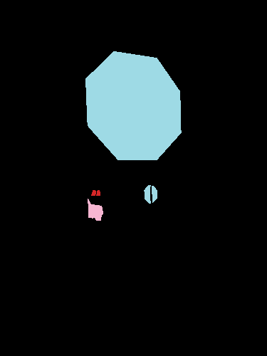

## Dataset Used
- **COCO 2017** (Common Objects in Context)
- 3000 training images (`train2017`), 600 validation images (`val2017`)
- Multi-class annotation format

## Processing Logic
- Used `pycocotools` to parse JSON annotations.
- Converted each object mask into a pixel-wise mask.
- Used `category_id` to represent class.
- In case of overlapping objects, the highest score annotation takes priority.

## Decisions & Edge Cases
- If annotation lacks segmentation: skipped.
- If two annotations overlap: one with higher score overwrites.
- If image file is missing: warning is logged, image skipped.

## Output
- Saved masks in `masks/train2017` and `masks/val2017`
- Pixel values: 1–90 (based on COCO categories)

## Example Outputs

| Original Image | Segmentation Mask |
|----------------|--------------------|
|  |  |
|  |  |
